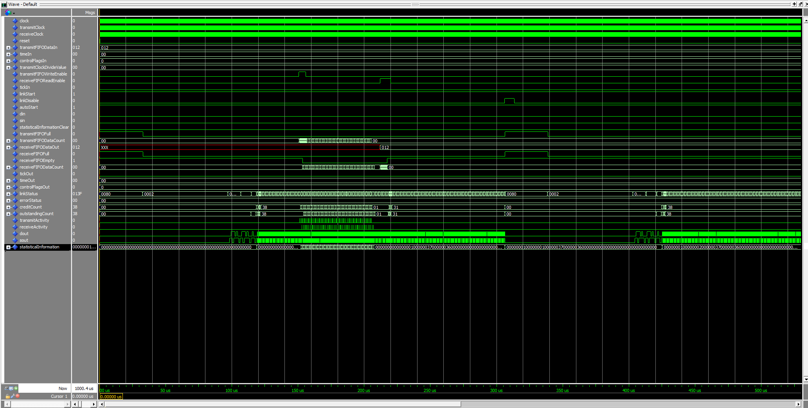

*******************************************************************************
Use functions instead of ROM tables for gray <-> binary encoding and some generalization of FIFO size 
Fixed hang when LinkDisable is used (link should now restart properly and flush FIFOs) 
Added loopback for testing purposes 
Config moved to top file as constants 
Stats as vector instead of array 
Translated the PDF doc to english (kind of) 
Note that current SpW config is for (as noted in the PDF) 
50MHz system clock 
100MHz Tx clock 
167MHz Rx clock 
2021/12/29 Walter 
*******************************************************************************
Open-source SpaceWire CODEC IP Core              Ver 1.21           2014/06/18 
*******************************************************************************
-------------------------------------------------------------------------------
|   File Name                                   | Version |        Date        |
-------------------------------------------------------------------------------
SpaceWireCODECIP.vhdl                            Ver 1.20 
SpaceWireCODECIPFIFO9x64.vhdl                    Ver 1.20 
SpaceWireCODECIPLinkInterface.vhdl               Ver 1.20 
SpaceWireCODECIPPackage.vhdl                     Ver 1.20 
SpaceWireCODECIPReceiverSynchronize.vhdl         Ver 1.21           2014/06/18 
SpaceWireCODECIPStateMachine.vhdl                Ver 1.20 
SpaceWireCODECIPStatisticalInformationCount.vhdl Ver 1.20 
SpaceWireCODECIPSynchronizeOnePulse.vhdl         Ver 1.20 
SpaceWireCODECIPTimeCodeControl.vhdl             Ver 1.20 
SpaceWireCODECIPTimer.vhdl                       Ver 1.20 
SpaceWireCODECIPTransmitter.vhdl                 Ver 1.20 
*******************************************************************************

