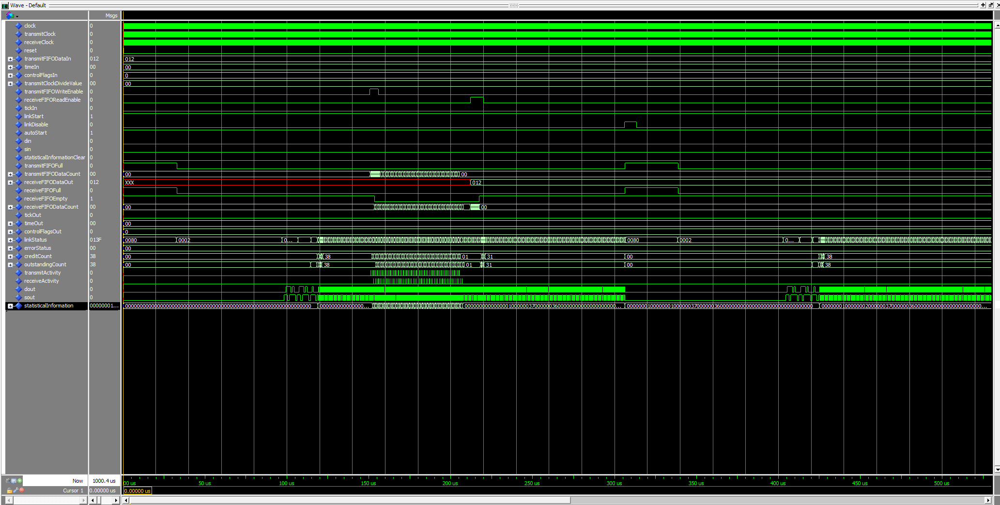

# SpaceWire CODEC IP Core

Open-source SpaceWire codec implementation with the transmitter, receiver, link interface, and supporting timing/state logic.

## Project status

The project has been reviewed for internal consistency and hardware-safety concerns.

- Syntax/editor diagnostics: clean across the VHDL sources
- Internal naming and port mismatches corrected
- Remaining risk areas are limited to hardware-level timing concerns rather than syntax or wiring errors

### Current hardware-safety review notes

- Cross-clock-domain handling around transmit control signals should be reviewed closely
- Credit/outstanding counter arithmetic should be checked for wraparound behavior
- Link-state transitions during startup/reset should be validated under timing margin stress

## Reference configuration

The original project notes indicate the following expected operating assumptions:

- 50 MHz system clock
- 100 MHz transmit clock
- 167 MHz receive clock

## Hierarchical structure

```text
SpaceWireCODECIP.vhdl
├─ SpaceWireCODECIPLinkInterface.vhdl
│  ├─ SpaceWireCODECIPReceiverSynchronize.vhdl
│  ├─ SpaceWireCODECIPTransmitter.vhdl
│  │  └─ SpaceWireCODECIPSynchronizeOnePulse.vhdl
│  ├─ SpaceWireCODECIPStateMachine.vhdl
│  │  └─ SpaceWireCODECIPSynchronizeOnePulse.vhdl
│  ├─ SpaceWireCODECIPTimer.vhdl
│  ├─ SpaceWireCODECIPTimeCodeControl.vhdl
│  ├─ SpaceWireCODECIPStatisticalInformationCount.vhdl
│  │  └─ SpaceWireCODECIPSynchronizeOnePulse.vhdl
│  └─ SpaceWireCODECIPFIFO9x64.vhdl
└─ (top-level FIFO and system control glue)
```

This shows the main integration path: the top-level codec instantiates the link interface, which then connects the receiver, transmitter, state machine, timer, timing-control, and statistics blocks.

## History

- 2021/12/29: loopback mode added for testing
- Fixed hang behavior when LinkDisable is used
- Gray/binary and FIFO sizing updates
- Statistical information moved to vector representation
- Documentation translated from the PDF to English

## Notes

This repository is intended as an FPGA-friendly SpaceWire CODEC reference core. It is reasonable for review and experiment, but the remaining hardware-safety checks should be completed before production use.


